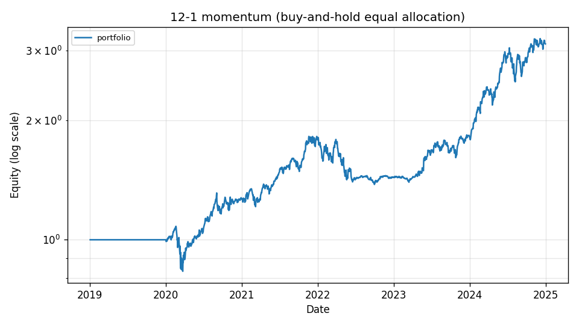
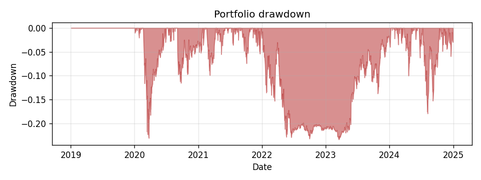
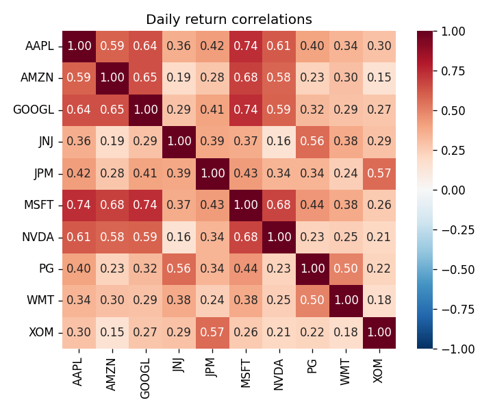

# quantlab

[](./.github/workflows/ci.yml)


> A reproducible equity-analysis pipeline for Yahoo Finance data: streaming and rolling risk metrics, parallel backtests, parametric and historical VaR, and benchmark scikit-learn forecasts packaged for testability.

This is the final-project deliverable for **ORIE 5270 — Big Data Technologies (Spring 2026)**.

---

## Research question and headline result

> *Does an equal-weight per-ticker 12-1 time-series momentum strategy on a basket of large-cap U.S. equities deliver positive risk-adjusted returns?*

Run on **real Yahoo Finance daily prices**, 10 large-cap tickers (AAPL, MSFT, GOOGL, AMZN, NVDA, JPM, XOM, JNJ, PG, WMT) over **2019-01-02 → 2024-12-30** (1,509 trading days, 15,090 rows). Reproduce with `python scripts/generate_reports.py --fetch`; the script falls back to a deterministic synthetic GBM panel when offline so tests and CI stay network-free.

| Metric | Value |
| --- | ---: |
| Average per-ticker Sharpe | **0.39** |
| Average annualised return | **11.72 %** |
| Average annualised volatility | **24.26 %** |
| Average maximum drawdown | **−33.42 %** |
| AAPL 10-day 99 % VaR — parametric Monte Carlo (20k paths) | **12.42 %** |
| AAPL 10-day 99 % VaR — historical simulation (rolling 10-day returns) | **13.38 %** |
| AAPL perfect-foresight per-share profit (DP, fee = $0.001/share) | **$1,441.69** |
| Best per-ticker Sharpe in panel (NVDA) | **1.05** |

Both VaR figures use the same 10-day horizon and 99 % confidence; the historical estimate is modestly higher than the parametric MC because the empirical 10-day-return distribution has fatter left-tails than the GBM fit.



| Drawdown (underwater) | Daily-return correlations |
| :---: | :---: |
|  |  |

All numbers also live in machine-readable form at [`reports/summary.json`](reports/summary.json), and the strategy metrics per ticker at [`reports/backtest_metrics.csv`](reports/backtest_metrics.csv).

> **Note:** The project is graded on engineering, not on returns. We report cross-validated metrics as a *workflow correctness* check, not as a claim that any strategy here is tradable.

---

## Architecture

```
   Yahoo Finance / Wikipedia
            │
            ▼
       data/  (yfinance, scraper, cache, in-memory SQLite)
            │
            ├──► streaming/  (Welford, two-heap median, top-K)
            │
            ├──► compute/    (rolling, parallel backtest, Monte Carlo VaR,
            │                 DP optimal execution, MapReduce aggregation)
            │
            ├──► models/     (features, scikit-learn forecaster, evaluation)
            │
            └──► portfolio/  (Markowitz mean-variance)
                     │
                     ▼
                 viz/  ──►  reports/  +  examples/end_to_end.ipynb
                     │
                     ▼
                  cli.py    (`quantlab fetch | backtest | forecast | var | sql`)
```

---

## Purpose

quantlab is a small, well-tested Python package that takes raw Yahoo Finance equity prices and produces:

* a clean, deduplicated, schema-validated long-format price panel (with on-disk CSV caching);
* per-ticker streaming and rolling risk statistics;
* a parallel per-ticker time-series momentum backtester;
* parametric (Monte Carlo) and non-parametric (historical) Value-at-Risk and CVaR;
* a baseline scikit-learn next-day return / direction forecaster with time-aware cross-validation;
* a Markowitz mean-variance portfolio constructor;
* publication-quality cumulative-return, drawdown, and correlation plots.

The point of the package is to demonstrate the engineering practices taught in ORIE 5270 — version control, unit tests with high coverage, multiprocessing, MapReduce, SQL window functions, web scraping, dynamic programming, and a documented public API — applied to a real (or realistic) dataset.

---

## Dataset

**Primary source:** Yahoo Finance via the [`yfinance`](https://github.com/ranaroussi/yfinance) Python client. Fetched columns: `date, open, high, low, close, adj_close, volume`, in long format with one row per `(ticker, date)`.

**Secondary source:** the S&P 500 constituent table on [Wikipedia](https://en.wikipedia.org/wiki/List_of_S%26P_500_companies), parsed with BeautifulSoup. Used to enumerate candidate tickers.

The default config (`configs/default.yaml`) ships with 10 large-cap tickers (AAPL, MSFT, GOOGL, AMZN, NVDA, JPM, XOM, JNJ, PG, WMT) covering Jan 2015 – Dec 2024.

This package is for educational and research use only. `yfinance` is not affiliated with Yahoo, and any use of Yahoo Finance data is subject to Yahoo's terms.

---

## Install

Requires Python 3.10 or newer.

```bash
git clone https://github.com/KaiZhang0723/quantlab.git
cd quantlab
pip install -e ".[dev,docs]"
```

Verify the install:

```bash
pytest --cov=quantlab
```

You should see *109 passed* and *95% coverage*.

---

## Usage

### Command-line interface

```bash
# 1. Fetch a price panel and cache it on disk.
quantlab fetch --tickers AAPL MSFT GOOGL --start 2020-01-01 --end 2024-12-31 \
               --out data/prices.csv --cache-dir .cache

# 2. Run a parallel 12-1 momentum backtest.
quantlab backtest --prices data/prices.csv --workers 4 \
                  --out reports/backtest_metrics.csv

# 3. Train a single-ticker direction forecaster with TimeSeriesSplit.
quantlab forecast --prices data/prices.csv --ticker AAPL \
                  --task classification --out reports/aapl_forecast.json

# 4. Estimate 10-day, 99% VaR / CVaR — parallel Monte Carlo and historical sim.
quantlab var --prices data/prices.csv --ticker AAPL --horizon 10 \
             --confidence 0.99 --paths 50000 --workers 4

# 5. SQL window-function analytics (cross-sectional rank, rolling volume, momentum).
quantlab sql --prices data/prices.csv --query rank --limit 10
```

A YAML config file supplies the `tickers`, `start`, and `end` defaults consumed by the `fetch` subcommand:

```bash
quantlab --config configs/default.yaml fetch --out data/prices.csv
```

### Python API

The most-used types are re-exported from the top-level package:

```python
from datetime import date
from quantlab import CSVCache, YFinanceSource, momentum_strategy, run_backtest

src    = CSVCache(YFinanceSource(), root=".cache")
prices = src.fetch(["AAPL", "MSFT"], date(2020, 1, 1), date(2024, 12, 31))
result = run_backtest(prices, strategy=momentum_strategy, n_workers=4)

print(result.metrics_table())
```

### Notebook

Open [`examples/end_to_end.ipynb`](examples/end_to_end.ipynb) for a one-page walk-through of every module on a deterministic synthetic panel.

### Regenerate the committed sample reports

```bash
make reports         # equivalent to: python scripts/generate_reports.py
```

---

## Design decisions

These are the trade-offs the package makes deliberately. The full long-form version lives at [`docs/design_decisions.rst`](docs/design_decisions.rst).

* **CSV is the source of truth, SQLite is a runtime analytical layer.** Per the prof's Ed clarification (#82) we don't host an external DB. `data/sql_layer.py` loads CSVs into in-memory SQLite at runtime so we can demonstrate W9–W10 window functions (`OVER (PARTITION BY … ORDER BY …)`, `LAG`, `RANK`) without coupling the project to a server.
* **Tests never hit the network.** The yfinance source and Wikipedia scraper both accept an injected callable so unit tests pass a stub returning a saved fixture or fake DataFrame. CI is therefore deterministic.
* **Time-aware cross-validation.** `models/forecaster.py` uses `TimeSeriesSplit`, not random K-fold. Random splits leak future information into training when applied to time-ordered data.
* **Parallelism via `multiprocessing.Pool.map`.** Backtests and Monte Carlo VaR split work into deterministic non-empty chunks (`_split_evenly`) so the `N % n_workers != 0` edge case (Ed forum #66) is handled correctly. No locks needed because each worker writes to its own return value.
* **Pure-functional core.** The numerical modules return new objects rather than mutating inputs. Side effects (filesystem I/O, RNG seeding, multiprocessing pools) are confined to a thin shell in `cli.py`, `cache.py`, and `scripts/generate_reports.py`.
* **No SMOTE on time series.** The W14 lecture introduced SMOTE for imbalanced data; we deliberately *do not* use it. Synthetic samples constructed by KNN interpolation can leak future-dated rows into training, which violates causality. The classifier uses `class_weight="balanced"` instead, which keeps the cost-function correction strictly causal. (See [`docs/design_decisions.rst`](docs/design_decisions.rst) for more.)
* **No-look-ahead backtest convention.** Positions decided at the close of day *t-1* earn the return from *t-1* to *t*. The framework lags the strategy's positions by one period before applying them to returns, so a user-supplied strategy that uses `close[t]` cannot silently cheat. A dedicated unit test (`test_backtest_lookahead_protected`) verifies this guard.

---

## Test coverage

Measured by `pytest --cov=quantlab --cov-branch` on the committed test suite (118 tests, all passing offline). `cli.py` is included in the denominator; only `_logging.py` (a thin wrapper around stdlib `logging`) is omitted.

| Module | Line + branch | What's exercised |
| --- | ---: | --- |
| `data/base.py` | 97 % | Schema validation, `PriceQuery` invariants |
| `data/yfinance_source.py` | 85 % | MultiIndex / single-index normalisation, error wrapping |
| `data/wiki_constituents.py` | 87 % | HTML parsing, missing-table handling, fetcher injection |
| `data/cache.py` | 94 % | TTL hit / miss, partial fetches, on-disk round-trip |
| `data/sql_layer.py` | 100 % | Window functions, momentum signal, edge cases |
| `streaming/welford.py` | 100 % | Brute-force equivalence + `hypothesis` property tests |
| `streaming/median.py` | 100 % | `statistics.median` equivalence + `hypothesis` |
| `streaming/topk.py` | 100 % | Heap correctness + invalid-input handling |
| `compute/rolling.py` | 84 % | Closed-form drawdown / Sharpe / vol checks |
| `compute/optimal_execution.py` | 100 % | LeetCode-known answers for fee + k-trade variants |
| `compute/montecarlo.py` | 100 % | Serial / parallel agreement, Ed-#66 split edge case |
| `compute/backtest.py` | 100 % | Parallel + serial paths, short-history error handling |
| `compute/sector_aggregate_mr.py` | 98 % | Mapper / reducer unit tests + `run_inline` reference |
| `models/features.py` | 100 % | No-look-ahead invariant, target columns, error paths |
| `models/forecaster.py` | 95 % | Both tasks, CV, fit-before-predict guards |
| `models/evaluation.py` | 90 % | Per-group metrics, single-class AUC handling |
| `portfolio/markowitz.py` | 100 % | 2-asset closed form, sum-to-1, long-short shorting |
| `viz/*` | 90–93 % | Headless smoke tests on figure construction |
| **TOTAL** | **95 %** | 800 statements, 190 branches |

Run `make cov` to regenerate the report locally.

---

## Course-topic coverage

| Week | Topic | Where in this repo |
| --- | --- | --- |
| W2–3 | Bash | `.github/workflows/ci.yml`, `Makefile` |
| W3 | Git | Linear feature-branch history, conventional commits |
| W4 | TDD, packaging, Sphinx, Google docstrings | `tests/` (unittest.TestCase), `docs/`, `pyproject.toml` |
| W5–6 | Heap, hash map, complexity | `streaming/topk.py`, `streaming/median.py` |
| W7 | Dynamic programming | `compute/optimal_execution.py` |
| W7 | Data streams | `streaming/` (entire subpackage) |
| W8 | Multiprocessing | `compute/backtest.py`, `compute/montecarlo.py` |
| W9 | MapReduce | `compute/sector_aggregate_mr.py` (`mrjob`) |
| W9–10 | SQL window functions | `data/sql_layer.py` |
| W11–12 | Web scraping | `data/wiki_constituents.py` (BeautifulSoup) |
| W12–13 | scikit-learn | `models/forecaster.py` (Pipeline + TimeSeriesSplit) |
| Syllabus | Visualization | `viz/` (matplotlib + seaborn) |

---

## Documentation

Full HTML documentation is built from [`docs/`](docs/) with Sphinx (autodoc + napoleon for Google-style docstrings + myst-parser):

```bash
make docs       # output: docs/_build/html/index.html
```

---

## Known limitations

- The default 12-1 momentum strategy is a pedagogical baseline, not a tradable strategy.
- The backtester is gross-of-cost: transaction fees, slippage, borrow costs, and survivorship bias are not modelled. Transaction costs are modelled only in `compute/optimal_execution.max_profit_with_fee` (a perfect-foresight upper bound).
- ML forecasts are reported as cross-validated workflow checks, not alpha claims.
- Yahoo Finance results may shift if regenerated live (data revisions, splits / dividend adjustments). Results above are from a regeneration on **2026-05-04**; the committed `reports/sample_prices.csv` lets the prof reproduce them exactly without hitting the network.
- `yfinance` is an unaffiliated third-party client; if Yahoo's response shape changes, the offline `--use-synthetic` path still produces a complete report.
- Tests use deterministic synthetic panels and mocked network calls; CI never touches the public internet.

## License

[MIT](LICENSE) — © 2026 Kai Zhang.

---

## Acknowledgements

This project was developed with assistance from Claude Code (Anthropic) as a coding collaborator. All design decisions, trade-offs, and code were reviewed and approved by the author.
